# Notary - JWT Viewer and Validator

A powerful Visual Studio Code extension for decoding, inspecting, and validating JSON Web Tokens (JWTs).

---

JWT Viewer with Remote Key Verification
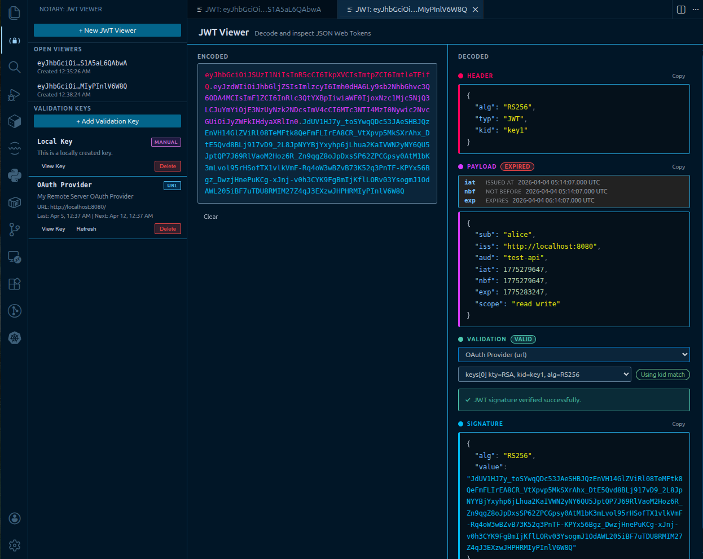

## Features

### 🔍 JWT Decoding
- **Visual Decoding**: Paste any JWT and instantly see its decoded header, payload, and signature
- **Syntax Highlighting**: Color-coded JSON output for easy reading
- **Timestamp Conversion**: Automatically converts `iat`, `nbf`, and `exp` claims to human-readable dates
- **Expiration Badge**: Visual indicator showing if the token is expired or still valid
- **Multi-Panel Support**: Open multiple JWT viewers simultaneously for comparison

### 🔐 JWT Signature Validation
- **Public Key Validation**: Validate JWT signatures against saved public keys
- **Multiple Key Sources**:
  - **OIDC/JWKS URLs**: Automatically fetch keys from OpenID Connect discovery endpoints
   - **JWKS JSON Entry**: Paste full JWKS documents directly (stored as a key set)
  - **Manual Entry**: Add public keys directly in PEM or raw format
- **Key Management**: Store, list, and delete validation keys from the sidebar
- **Auto-Refresh**: URL-based keys can be configured to refresh automatically (daily, weekly, or monthly)
- **JWKS Key Selection**: JWT `kid` is used first, with optional manual override in the JWT Viewer
- **Key Viewing**: Review stored key material and derived public keys in decoded (PEM) format

### 🎨 User Interface
- **Sidebar View**: Quick access to open viewers and key management
- **Editor Panel**: Full-featured JWT viewer with validation controls
- **Activity Bar Icon**: Dedicated Notary icon in the VS Code activity bar
- **Keyboard Shortcuts**: `Ctrl+Shift+J` / `Ctrl+Alt+J` (or `Cmd+Shift+J` / `Cmd+Alt+J` on Mac) to open a new viewer

## Screenshots

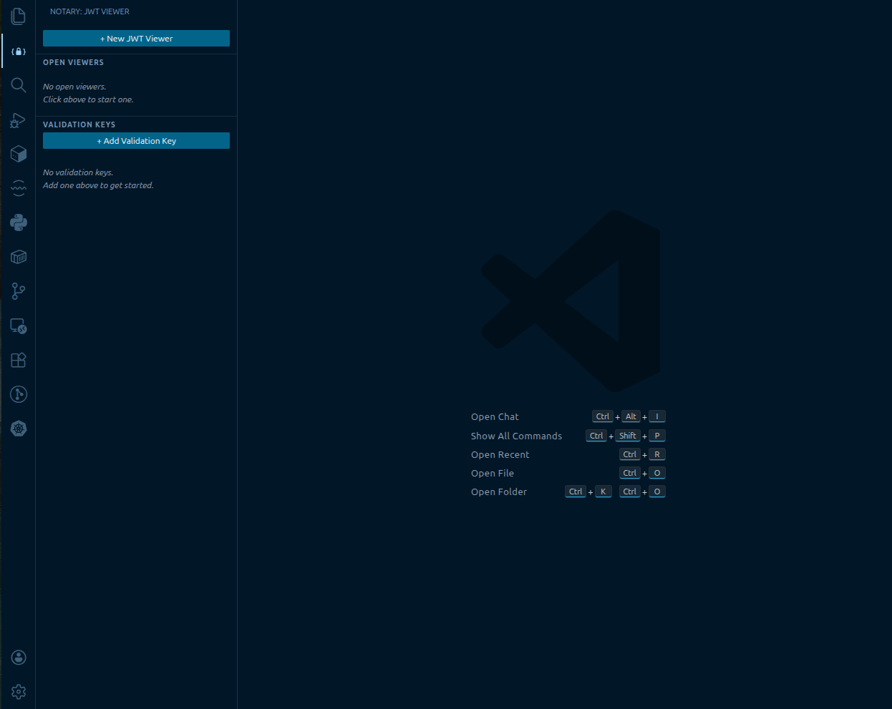

### Local Key

Entry
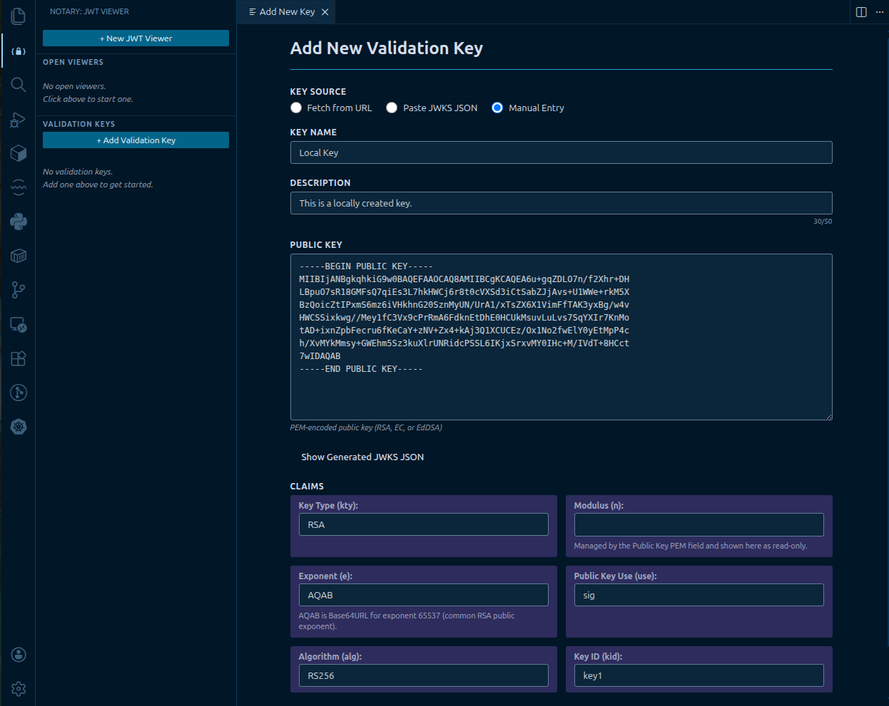

Edit
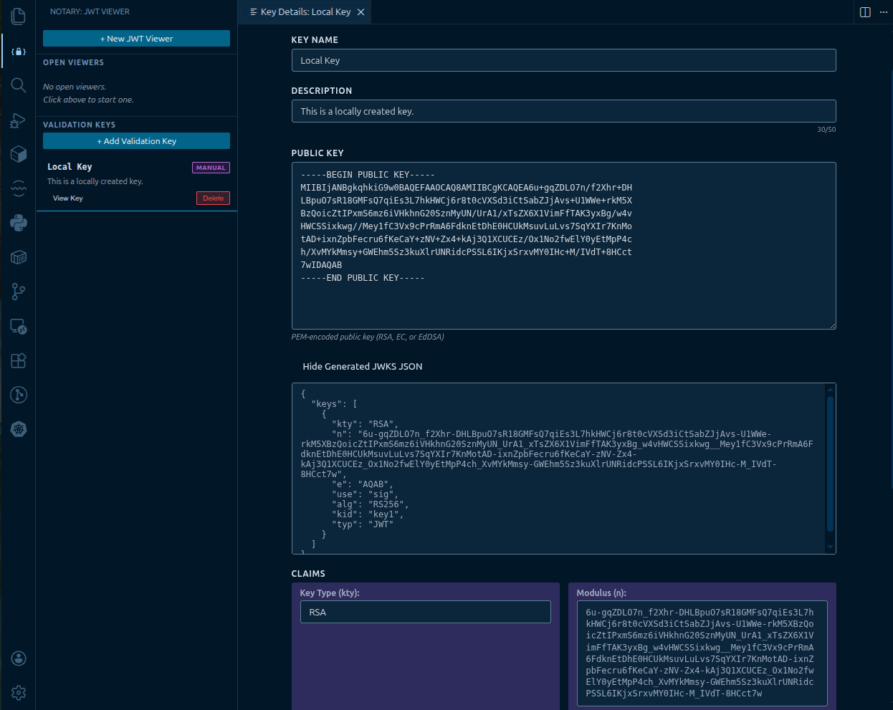

JWT Viewer with Local Key Verification
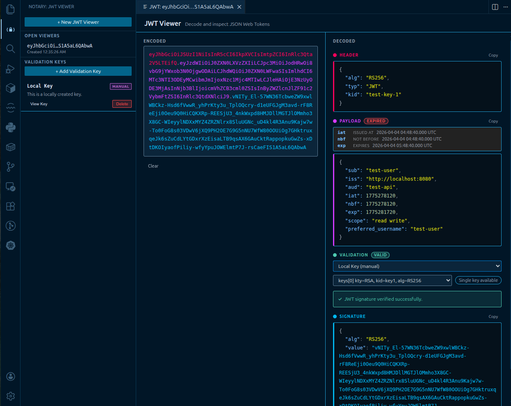

### Remote Key

Entry
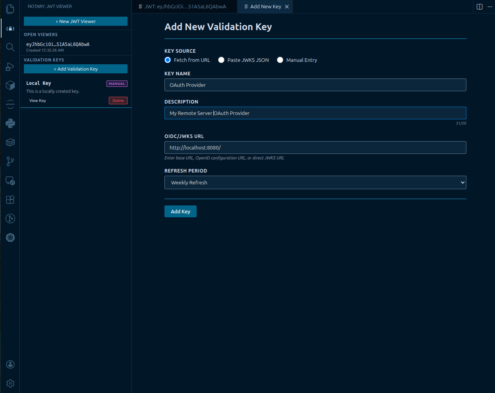

Edit
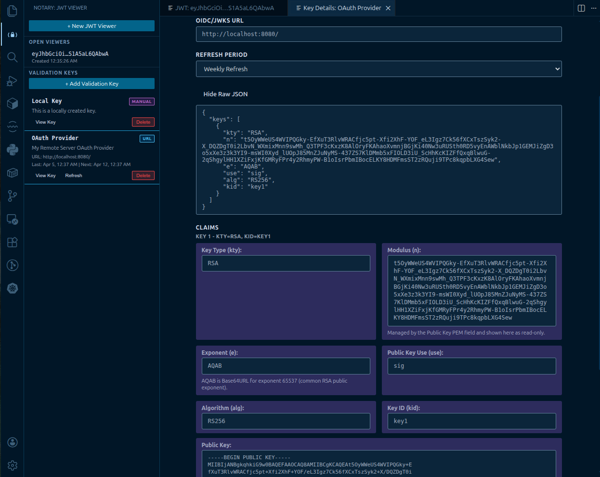


### JWKS Key

Entry
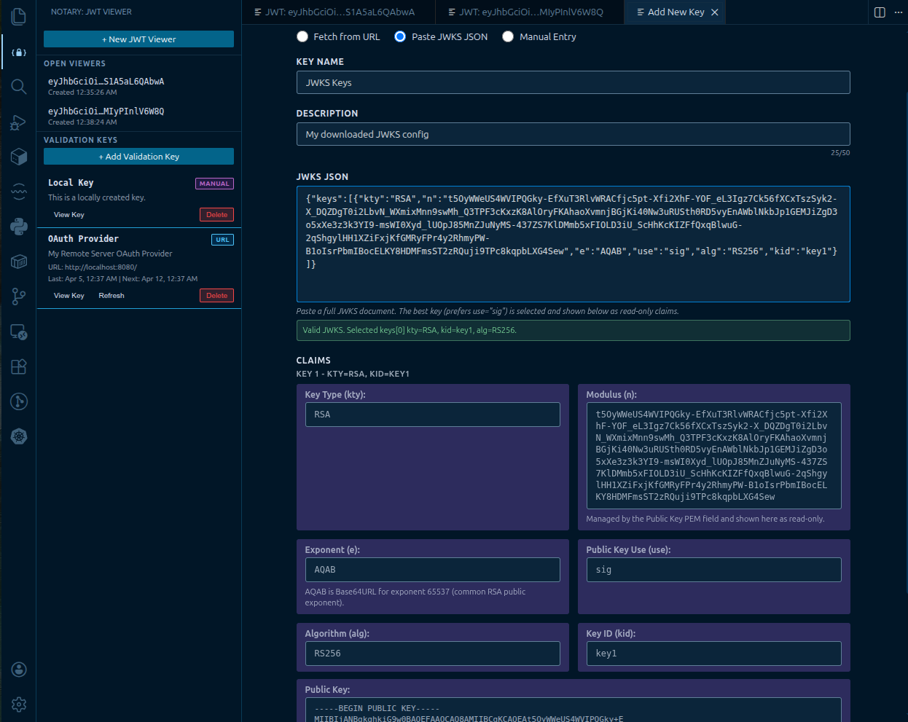

Edit
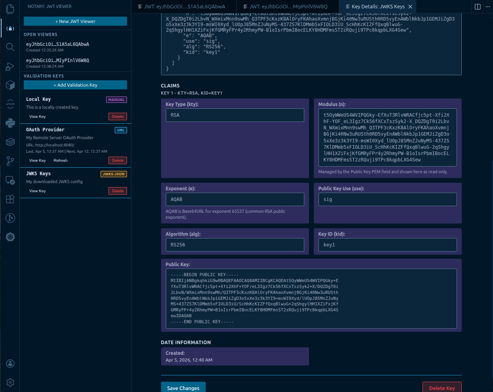

JWT Viewer with JWKS Verification
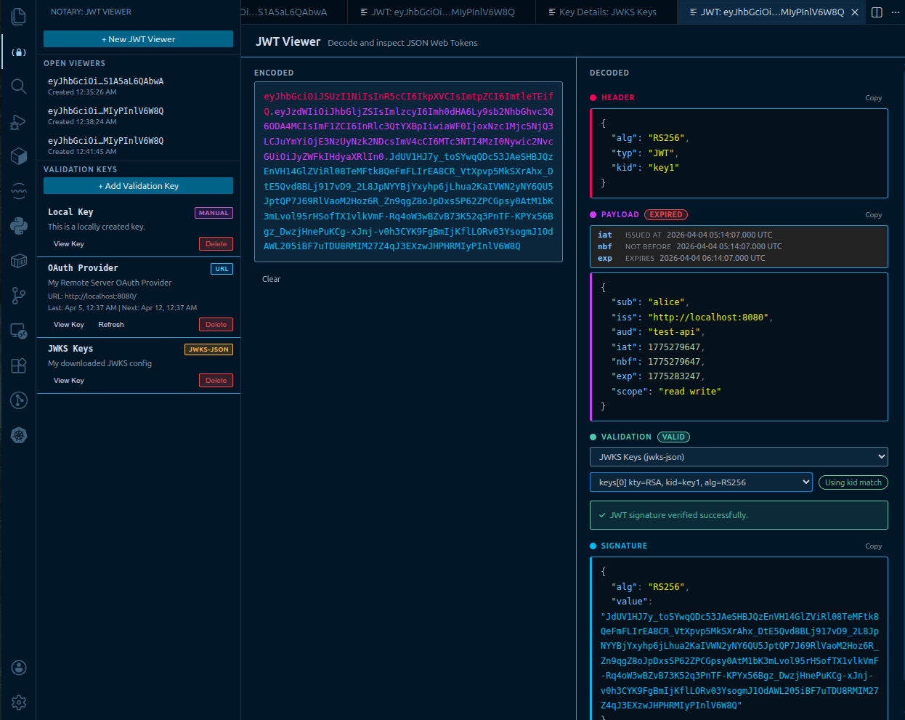
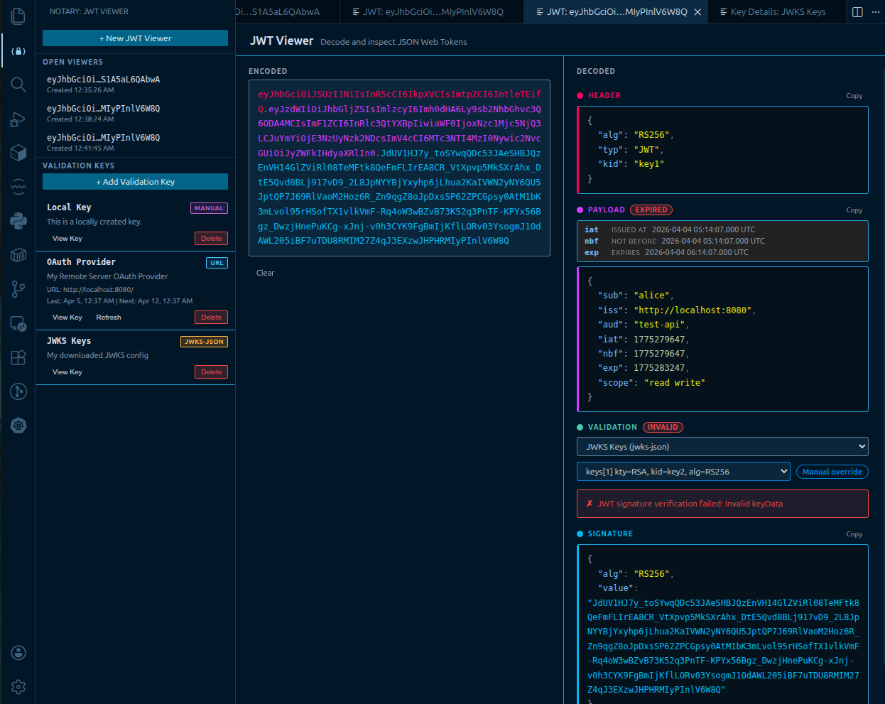


## Usage

### Viewing a JWT

1. Press `Ctrl+Shift+J` (or `Cmd+Shift+J` on Mac), or use the fallback `Ctrl+Alt+J` (`Cmd+Alt+J` on Mac), or run the command `Notary: Open JWT Viewer (Editor Panel)`
2. Paste your JWT token into the input field
3. The decoded header, payload, and signature will appear automatically
4. Timestamps are converted to readable dates
5. Token expiration status is shown with a badge

### Managing Validation Keys

All key creation now starts from the sidebar **Add Key** button, then you choose the source in the key details panel.

#### Adding a Key from OIDC/JWKS URL

1. Open the Notary sidebar from the activity bar
2. Click **Add Key**
3. Enter a name for your key
4. Select **Fetch from URL**
5. Enter one of the following URL formats:
   - **Base URL**: `https://example.com` (auto-discovers via .well-known)
   - **OpenID Configuration**: `https://example.com/.well-known/openid-configuration`
   - **Direct JWKS URL**: `https://example.com/.well-known/jwks.json`
6. Choose a refresh period (Daily, Weekly, or Monthly)
7. Click **Add Key**

The extension will automatically discover the JWKS endpoint from base URLs by attempting:
- OpenID Connect discovery via `/.well-known/openid-configuration`
- Direct JWKS fetch from `/.well-known/jwks.json`

#### Adding a Manual Key

1. Open the Notary sidebar
2. Click **Add Key**
3. Enter a name for your key
4. Select **Manual Entry**
5. Paste your public key in PEM format:
   ```
   -----BEGIN PUBLIC KEY-----
   MIIBIjANBgkqhkiG9w0BAQEFAAOCAQ8AMIIBCgKCAQEAx1dP8pZk6jJ6VY8Z9sR7
   QeZ0+9H8g8Y1VQZk4WwzK1z9Z2bNRzRZyM4VY9r7kVb6b4r1v4Wz7h5lQ1X9P9m3
   ...
   -----END PUBLIC KEY-----
   ```
6. Click **Add Key**

#### Adding a Key from JWKS JSON

1. Open the Notary sidebar
2. Click **Add Key**
3. Enter a name for your key
4. Select **Paste JWKS JSON**
5. Paste a full JWKS document, for example:
    ```json
    {
       "keys": [
          {
             "kty": "RSA",
             "n": "...",
             "e": "AQAB",
             "use": "sig",
             "alg": "RS256",
             "kid": "key1"
          }
       ]
    }
    ```
6. Review the key preview and claims shown in the panel
7. Click **Add Key**

When editing a JWKS JSON key, you can update the pasted JWKS document and save changes. Notary stores the full key set and uses JWT `kid` matching during validation.

Supported formats:
- RSA public keys (`-----BEGIN PUBLIC KEY-----` or `-----BEGIN RSA PUBLIC KEY-----`)
- Elliptic Curve (EC) public keys
- EdDSA public keys

Keys are stored securely in base64 encoding within VS Code's extension storage.

### Validating a JWT

1. Decode a JWT in the viewer panel
2. In the "Validation" section, select a validation key from the dropdown
3. Click "Validate Signature"
4. The validation result will appear showing whether the signature is valid

### Viewing Stored Keys

To review a stored public key:

1. Open the Notary sidebar
2. In the "Validation Keys" section, find the key you want to view
3. Click "View Key"
4. The decoded public key will open in a new editor tab

This allows you to verify the exact public key content that's stored (keys are stored in base64 encoding but displayed in their original PEM format).

## Requirements

- Visual Studio Code version 1.110.0 or higher

## Extension Settings

Currently, this extension does not contribute any VS Code settings. All configuration is done through the sidebar UI.

## Known Issues

Please report issues on the [GitHub repository](https://github.com/johnmanko/notary-vscode/issues).

## Development

### Building from Source

```bash
# Install dependencies
npm install

# Compile TypeScript
npm run compile

# Run tests
npm test

# Package for distribution
npm run package
```

### Running in Development Mode

1. Clone the repository
2. Run `npm install`
3. Open in VS Code
4. Press `F5` to launch the Extension Development Host

## Release Notes

See [CHANGELOG](./CHANGELOG.md)

## License

This project is licensed under the GNU General Public License v3.0 (GPL-3.0-only).

See the [LICENSE](LICENSE) file for details.

---

**Enjoy decoding and validating your JWTs with Notary!** 🔐

